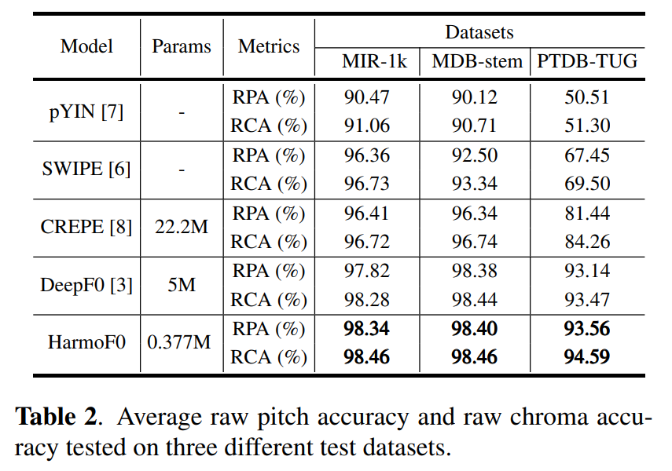

# HarmoF0 

This repo is the  pytorch implementation of ["HarmoF0: Logarithmic Scale Dilated Convolution For Pitch Estimation"](https://arxiv.org/abs/2205.01019). 

HarmoF0 is a light-weight and high-performance pitch tracking model using multi-rate dilated convolution. The evaluation results with threshold of 50 cents are:
  


## Usage

Install required packages using

```
pip install -r requirements.txt
```

Estimating pitch of a audio file using pretrained harmof0

```
python src/mono_pitch/pitch_tracker.py with \
    inference_mode=True \
    checkpoint_path=checkpoints/checkpoint_mdb-stem-synth.pth \
    save_activation=True \
    device=cpu \
    wav_path=wav/a.mp3
```
The results are saved in the input folder.

## Training

Download MDB-stem-synth and MIR-1K datasets and copy to the "data" folder as follows:

```
data
├── MDB-stem-synth
│   ├── annotation_stems
│   ├── audio_stems
│   ...
└── MIR-1K
    ├── PitchLabel
    ├── Wavfile
    ...
```


Prepare the datasets using

```
python src/prepare_mir_1k.py
python src/prepare_mdb_stem_synth.py
```

Train on MDB-stem-synth or MIR-1K:

```

python src/mono_pitch/pitch_tracker.py with \
    max_epochs=40 \
    dataset_name=MDB-stem-synth

```

Results and checkpoints are saved in the "results" folder.


